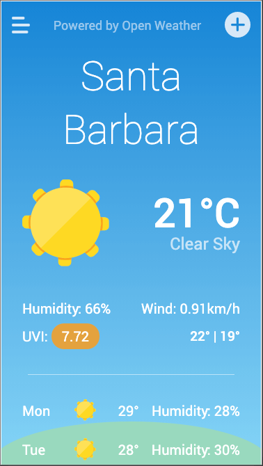
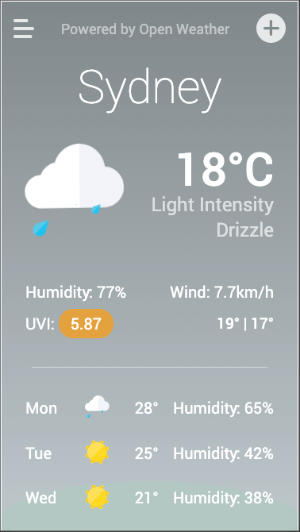
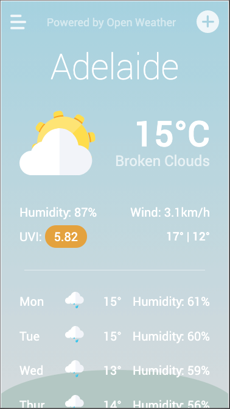
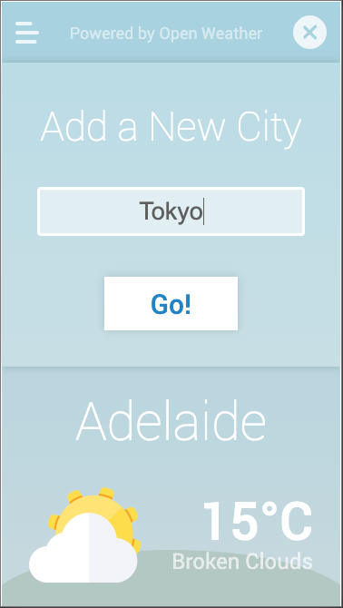
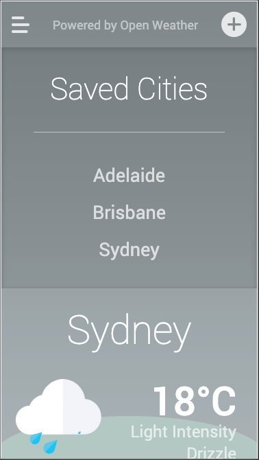

# Weather Forecast App

This is a simple mobile first weather app. It is built with jQuery and the Open Weather Map API.

Features include:

1. Custom animations and colours for the current weather
1. Remembers your previously entered cities in a shortlist for easy access
1. Gives both a "today" view and a 5 day forecast

## Link

https://rjwrightme.github.io/weather-forecast/

## Screenshots

The following images demonstrate the application functionality:

